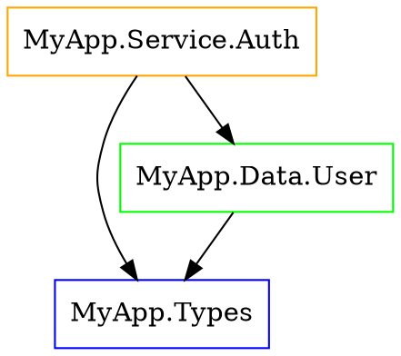

# Architecture Rules

Argus analyzes your module structure to detect architectural issues like circular dependencies, layer violations, and excessive coupling.

## Circular Dependencies

Circular dependencies make code harder to understand, test, and maintain.

### Detection

```
Circular dependency detected (length 3):
  Module.A → Module.B → Module.C → Module.A
```

Argus finds cycles up to a configurable maximum length.

### Configuration

```toml
[architecture]
enabled = true
max-cycle-length = 10  # Maximum cycle length to detect
```

### Resolution Strategies

1. **Extract shared types** to a separate module:
```
Before:
  A imports B (for type T)
  B imports A (for type U)

After:
  A imports Types
  B imports Types
  Types defines T and U
```

2. **Use type classes** for abstraction:
```haskell
-- Instead of A importing B for concrete type
class HasProcessor a where
  process :: a -> Result

-- B implements the class
instance HasProcessor BType where
  process = ...
```

3. **Dependency injection**:
```haskell
-- Instead of hardcoding dependency
runA :: BInterface -> IO ()
```

## Layer Violations

Define architectural layers and enforce that modules only import from allowed layers.

### Defining Layers

```toml
[architecture]
enabled = true

# Core layer - no dependencies outside core
[[architecture.layers]]
name = "Core"
patterns = ["*.Types", "*.Core", "*.Domain.*"]
can-import = ["Core"]

# Data layer - can use core
[[architecture.layers]]
name = "Data"
patterns = ["*.Data.*", "*.Model.*", "*.Repository.*"]
can-import = ["Core", "Data"]

# Service layer - can use core and data
[[architecture.layers]]
name = "Service"
patterns = ["*.Service.*", "*.UseCase.*", "*.Logic.*"]
can-import = ["Core", "Data", "Service"]

# API layer - can use everything except App
[[architecture.layers]]
name = "API"
patterns = ["*.API.*", "*.Handler.*", "*.Web.*"]
can-import = ["Core", "Data", "Service", "API"]

# App layer - can use everything
[[architecture.layers]]
name = "App"
patterns = ["Main", "*.App", "*.CLI", "*.Main"]
can-import = ["Core", "Data", "Service", "API", "App"]
```

### Layer Violation Detection

```
Layer violation detected:
  Module: MyApp.Service.UserService (layer: Service)
  Imports: MyApp.Handler.UserHandler (layer: API)
  Service layer cannot import from API layer
```

### Pattern Syntax

Patterns use glob-like syntax:
- `*` matches any characters in a module component
- `**` matches any number of module components
- `*.Foo` matches `Bar.Foo`, `Baz.Foo`
- `Foo.*` matches `Foo.Bar`, `Foo.Baz`
- `**/*.Types` matches `A.Types`, `A.B.Types`, `A.B.C.Types`

## Coupling Metrics

Argus calculates coupling metrics for each module:

### Afferent Coupling (Ca)

Number of modules that depend on this module.

High Ca = Many dependents = Be careful when changing

### Efferent Coupling (Ce)

Number of modules this module depends on.

High Ce = Many dependencies = Fragile, affected by many changes

### Instability (I)

```
I = Ce / (Ca + Ce)
```

- I = 0: Maximally stable (only depended upon)
- I = 1: Maximally unstable (only depends on others)

### Abstractness (A)

Ratio of abstract types to total types.

```
A = abstract_types / total_types
```

### Distance from Main Sequence (D)

```
D = |A + I - 1|
```

Optimal modules have D near 0 (balanced abstractness and instability).

### Configuration

```toml
[architecture]
# Warn if instability exceeds threshold
instability-threshold = 0.8

# Warn if coupling exceeds threshold
coupling-threshold = 15
```

### Viewing Metrics

```bash
argus architecture --metrics src/

# Output:
# Module                Ca  Ce  I     A     D
# MyApp.Types           15   2  0.12  0.80  0.08
# MyApp.Service.User     5   8  0.62  0.20  0.18
# MyApp.Handler.API      2  12  0.86  0.00  0.14
```

## Orphan Instances

Orphan instances (instances defined outside the module of type or class) can cause:
- Import order surprises
- Duplicate instance errors
- Hard-to-track behavior changes

### Detection

```
Orphan instance detected:
  Module: MyApp.Orphans
  Instance: ToJSON MyType
  Type 'MyType' defined in: MyApp.Types
  Class 'ToJSON' defined in: Data.Aeson
```

### Configuration

```toml
[architecture]
check-orphans = true
```

### Exceptions

```toml
# Allow orphans in specific modules
[[scopes]]
modules = ["*.Orphans", "*.Instances"]
ignore = ["architecture/orphan-instance"]
```

## DOT Graph Export

Visualize your module dependencies:

```bash
argus architecture --output graph.dot src/
```

Generates DOT format for Graphviz:



### Rendering

```bash
dot -Tsvg graph.dot -o dependencies.svg
dot -Tpng graph.dot -o dependencies.png
```

### Customization

```bash
# Color by layer
argus architecture --output graph.dot --color-by layer src/

# Highlight cycles
argus architecture --output graph.dot --highlight-cycles src/

# Size by coupling
argus architecture --output graph.dot --size-by coupling src/
```

## Qualified Import Enforcement

Ensure certain modules are imported qualified:

```toml
[architecture]
check-qualified = true

[[architecture.require-qualified]]
modules = ["Data.Map", "Data.Map.Strict"]
as = "Map"
reason = "Avoid name clashes with Prelude"

[[architecture.require-qualified]]
modules = ["Data.Text", "Data.Text.Lazy"]
as = "T"

[[architecture.require-qualified]]
modules = ["Data.ByteString", "Data.ByteString.Lazy"]
as = "BS"
```

Detection:

```
Unqualified import of Data.Map
  Expected: import qualified Data.Map as Map
  Found: import Data.Map
```

## Module Size

Track module sizes:

```toml
[architecture]
max-module-lines = 500
max-module-exports = 50
```

```
Module too large:
  Module: MyApp.BigModule
  Lines: 750 (max: 500)
  Consider splitting into smaller modules
```

## Common Patterns

### Clean Architecture

```toml
[[architecture.layers]]
name = "Domain"
patterns = ["*.Domain.*"]
can-import = ["Domain"]

[[architecture.layers]]
name = "Application"
patterns = ["*.Application.*", "*.UseCase.*"]
can-import = ["Domain", "Application"]

[[architecture.layers]]
name = "Infrastructure"
patterns = ["*.Infrastructure.*", "*.Adapter.*"]
can-import = ["Domain", "Application", "Infrastructure"]

[[architecture.layers]]
name = "Presentation"
patterns = ["*.Web.*", "*.API.*", "*.CLI.*"]
can-import = ["Domain", "Application", "Infrastructure", "Presentation"]
```

### Hexagonal Architecture

```toml
[[architecture.layers]]
name = "Core"
patterns = ["*.Core.*", "*.Domain.*"]
can-import = ["Core"]

[[architecture.layers]]
name = "Ports"
patterns = ["*.Port.*", "*.Interface.*"]
can-import = ["Core", "Ports"]

[[architecture.layers]]
name = "Adapters"
patterns = ["*.Adapter.*", "*.Driver.*"]
can-import = ["Core", "Ports", "Adapters"]
```

## Best Practices

1. **Start early**: Define layers at project start
2. **Keep core pure**: No IO in domain layer
3. **Depend on abstractions**: Use type classes at boundaries
4. **Review cycles immediately**: They only get harder to fix
5. **Monitor metrics**: Track coupling over time

## Next Steps

- **[Imports Rules](./imports)**: Import hygiene
- **[Custom Rules](./custom-rules)**: Project-specific architecture rules
- **[CI Integration](../usage-guide/ci-integration)**: Automated architecture checks
